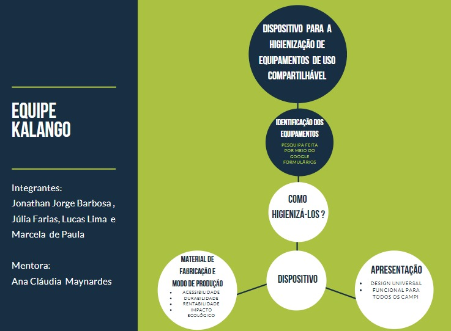

# Kalango

## Sumário
* [Integrantes](#integrantes)
* [Descrição](#descrição)
* [Solução](#solução)
* [Conteúdos](#conteúdos)

## Integrantes
* Jonathan Jorge Barbosa
* Júlia Farias
* Lucas Lima
* Marcela de Paula
* **Mentora**: Ana Cláudia Maynardes

## Descrição
* PROJETO: Kmaleão
* NOME DA EQUIPE: Kalango
* Período de Execução
	* Data de início: 27/06/2020
	* Data de término: 30/06/2020
* Valor Total: R$ 112,00
* Objetivo: Auxiliar no processo de higienização dos equipamentos de uso compartilhado na UnB.
* Caracterização do público-alvo: Todos aqueles que necessitam frequentar a Universidade de Brasília no período de pandemia.
* Justificativa do Projeto: Como a UnB tem, aproximadamente, 24 laboratórios abertos ao uso dos alunos, com, em média, 849 computadores; tem 14 secretarias de graduação e pós graduação que disponibilizam equipamentos para uso coletivo; e tem também toda a área administrativa da reitoria, CDT, prefeitura e entre outros espaços. Em vista disso, o (produto) protege os equipamentos que não podem ser higienizados com solução líquida.

# Conteúdos
* [Imagens](./assets/img/)
* [Documento](./assets/doc/)
* [Projeto](./project/)
* [Pitch](https://www.youtube.com/watch?v=6F1jNubBVRM)

